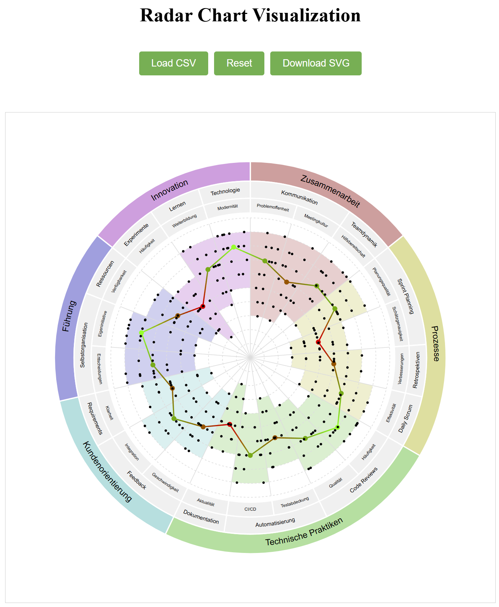

# Radar Chart Visualization

A dynamic, interactive radar chart visualization tool built with D3.js. This project provides a web-based interface for visualizing hierarchical data in a circular layout with concentric rings, making it ideal for displaying nested categorical data with associated values.

## Example Visualization



## Features

- **Hierarchical Data Visualization**: Display data in three concentric rings representing different levels of hierarchy (Bereich, Aspekt, Frage)
- **Dynamic Text Sizing**: Automatically adjusts text size to fit within segments
- **Interactive Elements**: Hover effects and dynamic updates
- **Data Import**: Support for CSV file import with specific formatting
- **SVG Export**: Export the visualization as an SVG file
- **Responsive Design**: Adapts to different screen sizes
- **Median Value Display**: Shows median values with color-coded indicators

## Installation

1. Clone the repository:
   ```bash
   git clone https://github.com/danielfrey63/radar-chart.git
   ```

2. Install dependencies:
   ```bash
   cd radar-chart
   npm install
   ```

3. Start the server:
   ```bash
   npm start
   ```

4. Open your browser and navigate to `http://localhost:3000`

## CSV Data Format

The visualization expects CSV files with the following columns:
- `Bereich`: Top-level category
- `Aspekt`: Mid-level category
- `Frage`: Detailed question or metric
- `Wert`: Numerical value (0-9)

Example:
```csv
Bereich,Aspekt,Frage,Wert
"Category A","Subcategory 1","Metric 1",7
```

## Usage

1. **Load Data**:
   - Click "Load CSV" to select and load a CSV file

2. **View Visualization**:
   - Outer ring: Bereich (main categories)
   - Middle ring: Aspekt (sub-categories)
   - Inner ring: Frage (individual metrics)
   - Center: Radar chart showing values

3. **Export**:
   - Click "Download SVG" to save the visualization as an SVG file

4. **Reset**:
   - Click "Reset" to return to the default visualization

## Technical Details

### Architecture
- Frontend: HTML5, D3.js for visualization
- Backend: Node.js with Express
- Data Processing: CSV parsing with csv-parse

### Key Components
- `server.js`: Express server handling file uploads and data processing
- `radar-chart.js`: Main visualization logic using D3.js
- `index.html`: Web interface

### Visualization Structure
1. **Outer Rings**: 
   - Three concentric rings showing hierarchical data
   - Dynamic text sizing based on segment size
   - Color-coded segments

2. **Radar Chart**:
   - Central visualization of numerical values
   - Median indicators
   - Background coloring matching outer ring segments

## Dependencies

- Node.js
- Express (^4.18.2)
- D3.js (^7.8.5)
- csv-parse (^5.5.3)

## Browser Compatibility

Tested and supported in modern browsers:
- Chrome (recommended)
- Firefox
- Edge
- Safari

## Contributing

1. Fork the repository
2. Create your feature branch (`git checkout -b feature/AmazingFeature`)
3. Commit your changes (`git commit -m 'Add some AmazingFeature'`)
4. Push to the branch (`git push origin feature/AmazingFeature`)
5. Open a Pull Request

## License

This project is open source and available under the MIT License.

## Version History

- 1.5.0: Improved text rendering and aspect count calculation
- 1.0.0: Initial release

## Acknowledgments

- D3.js community for the visualization library
- Contributors and users who provided feedback and suggestions
