# Feature Dependencies Diagram

```mermaid
graph TD
    %% Core Features
    S1.1[1.1 View Data Hierarchy]
    S2.1[2.1 CSV Upload]
    S5.1[5.1 Data Persistence]

    %% Visualization Dependencies
    S1.2[1.2 Segment Navigation]
    S1.3[1.3 Color Scheme]
    S1.4[1.4 Zoom and Pan]
    S1.5[1.5 Custom Ring Labels]
    S3.1[3.1 Text Readability]
    S3.4[3.4 Customizable Colors]
    S3.5[3.5 Keyboard Navigation]

    %% Data Processing Dependencies
    S2.4[2.4 Batch Import]
    S2.5[2.5 Data Export]
    S4.1[4.1 Median Values]
    S4.2[4.2 Distribution Analysis]
    S4.3[4.3 Comparative Analysis]
    S4.4[4.4 Historical Tracking]

    %% Backend Dependencies
    S5.3[5.3 API Access]
    S5.4[5.4 Automated Backups]
    S6.1[6.1 Large Datasets]
    S6.3[6.3 Data Caching]
    S6.4[6.4 Offline Mode]

    %% UI and Accessibility
    S6.2[6.2 Mobile Responsive]
    S7.3[7.3 Accessibility]
    S7.4[7.4 Print Optimization]

    %% Core Dependencies
    S1.1 --> S1.2
    S1.1 --> S1.4
    S1.1 --> S3.1
    S1.1 --> S1.5
    S1.1 --> S7.4

    S2.1 --> S2.4
    S2.1 --> S2.5
    S2.1 --> S4.3
    S2.1 --> S4.4

    S5.1 --> S5.3
    S5.1 --> S5.4
    S5.1 --> S6.3
    S5.1 --> S6.4

    %% Visualization Chain
    S1.2 --> S3.5
    S1.3 --> S3.4
    S1.4 --> S6.2

    %% Data Analysis Chain
    S4.1 --> S4.3
    S4.2 --> S4.3

    %% Backend Chain
    S6.1 --> S6.3
    S6.3 --> S6.4

    %% Accessibility Chain
    S3.4 --> S7.3
    S3.5 --> S7.3

    %% Styling
    classDef core fill:#f9f,stroke:#333,stroke-width:4px
    classDef phase1 fill:#dfd,stroke:#333
    classDef phase2 fill:#ddf,stroke:#333
    classDef phase3 fill:#fdd,stroke:#333
    classDef phase4 fill:#ffd,stroke:#333

    %% Apply styles
    class S1.1,S2.1,S5.1 core
    class S1.2,S1.3,S3.1 phase1
    class S4.1,S4.2,S1.4,S3.4 phase2
    class S2.4,S4.3,S5.3,S6.3 phase3
    class S6.2,S7.3,S6.4,S7.4 phase4

```

## Legende

- 🟪 **Core Features** (Phase 0)
  - Grundlegende Funktionen, von denen andere abhängen

- 🟩 **Phase 1: Basis-Interaktivität**
  - Erste Erweiterungen der Grundfunktionen

- 🟦 **Phase 2: Erweiterte Funktionen**
  - Zusätzliche Analysefunktionen und Anpassungen

- 🟥 **Phase 3: Fortgeschrittene Features**
  - Komplexere Funktionalitäten und Integrationen

- 🟨 **Phase 4: Optimierung & Zugänglichkeit**
  - Verbesserungen der Benutzererfahrung und Zugänglichkeit

## Hinweise zum Diagramm

- Pfeile zeigen die Abhängigkeitsrichtung (A → B bedeutet: B benötigt A)
- Die Farben entsprechen den verschiedenen Implementierungsphasen
- Die dickeren Rahmen markieren die Core-Features
- Features ohne eingehende Pfeile können unabhängig implementiert werden
- Features mit mehreren eingehenden Pfeilen haben mehrere Abhängigkeiten
